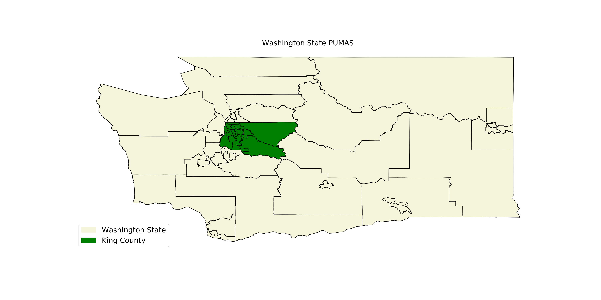
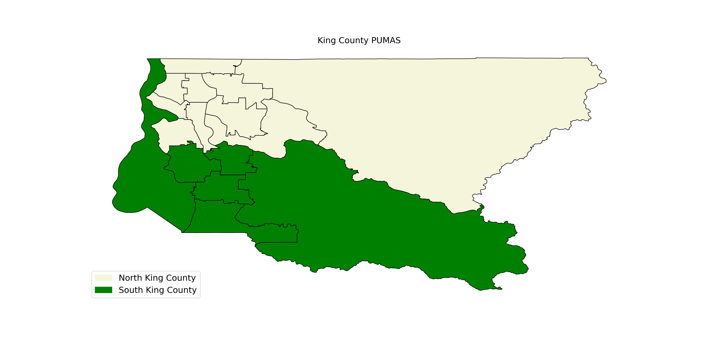

# Memo: South King County Opportunity Youth

by [Daihong Chen](https://github.com/Daihongchen), [Hamza Masood](https://github.com/hmdev649), and [Calvin Tirrell](https://github.com/calvintirrell)

This project offers an updated estimate of the number of Opportunity Youth in South King County using the 2017 5-year American Community Survey [(ACS)](https://www.census.gov/programs-surveys/acs/about.html) Public Use Microdata Survey [(PUMS)](https://www.census.gov/programs-surveys/acs/technical-documentation/pums.html).

## Agenda:

1. [Recap of original study](#recap-of-2016-study)
2. [Methodology](#methodology)
    * Geographical boundaries of South King County
3. [Updated breakdown of Opportunity Youth (O.Y.) by age](#findings-from-comparing-2016-reports-and-current-analysis)
4. [Recommendations for SRP](#recommendations)
5. [Next steps for analysis](#next-steps)

## Recap of 2016 Study:

O.Y. were an estimated 13% of the total youth population, i.e. people between the ages of 16 and 24 who are neither in school nor working (~19K of ~140K).

Why OY Matter:

 * Social and economic costs for O.Y., the government and society at large
 * Talent pipeline solution for existing shortfall of candidates for local jobs

Data compiled by [The Community Center for Education Results (CCER)](https://roadmapproject.org/about-ccer/)
    
In support of [The Road Map Project](https://roadmapproject.org/)
    
For use by:

 * Seattle Region Partnership
 * Seattle Metropolitan Chamber of Commerce
 * Seattle Foundation
 * City of Seattle
 * King County

## Methodology:

Identify O.Y. from PUMS 2013-2017 dataset published by the ACSO:

 * Age
 * Sex
 * Employment Status
 * Race
 * Educational Attainment
 * PUMA Region (limited to South King County)

Identify South King County from MAF/TIGER DB published by the US Census Bureau:

 * Use shapefiles to plot all counties in Washington; isolate King County; highlight South King County, defined by PUMA regions (11610-11615)

| King County | South King County |
| ----------- | ----------------- |
|  |  |

Assess trend between most recently available data (2017) and from original report (2014)

## Findings from Comparing 2016 Reports and Current Analysis:

 * Total sample size has dropped by 39%
 * The proportion of O.Y. to total youth population has slightly decreased
 * In the long run, the goal is for both O.Y. and youth working without diplomas to both decrease
 * There are now proportionally fewer college-educated O.Y. across all age brackets
 * In terms of race: a). as a share of all American Indian/Alaska Native youth, higher percentage are now classified as OY. b). As a share of all OY, Hispanic youth are now a higher percentage.

    
## Recommendations:

 * Assess ROI of existing support programs and derive recommendations for greater efficiency
 * Highlight some individual success stories to the local business community to drive better hiring
 * Focus more on OY segments showing least improvement

## References:

Seattle Region Partnership. 2016. “King County Opportunity Youth Overview: Demographics of opportunity youth and systemic barriers to employment”. Available at: https://bit.ly/2oRGz37.

Yohalem, N., Cooley, S. 2016. “Opportunity Youth in the Road Map Project Region”. Community Center for Education Results. Available at: https://bit.ly/2P2XRF3.

ACS 5-Year Estimates - Public Use Microdata Sample (2017). Available at https://bit.ly/37opwpi.

TIGER/Line Shapefile, 2017, 2010 state, Washington, 2010 Census Public Use Microdata Area (PUMA) State-based. Available at https://bit.ly/31P8Iqu.

## Next Steps:

 * Data Freshness & Richness
 * Precisely duplicate sample set of 2016 report
 * Use PUMA Survey from 2014-2018
 * Include all intervening years in trend analysis
 * Additional EDA
 * Choropleth of O.Y. data by PUMA
 * Available jobs for < 29 in South King County by PUMA:
 * Most popular industries for employment
 * Industries with the greatest shortage of workers
 * Expanded Scope
 * Track O.Y. pipeline over time

